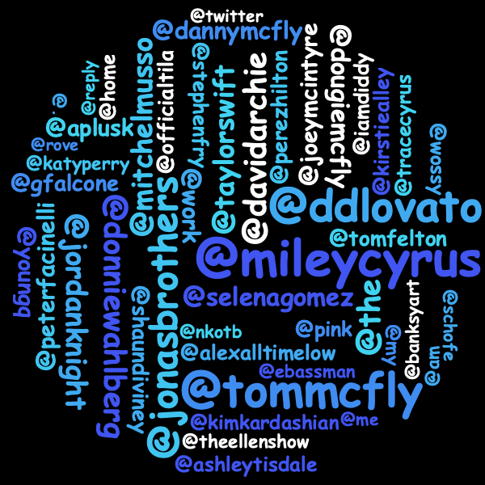
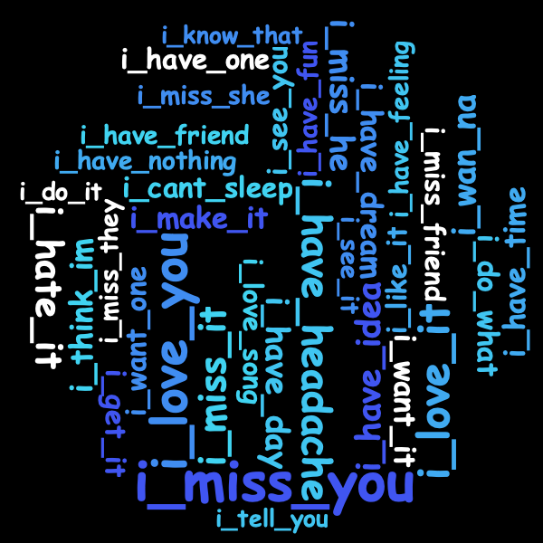

## Sentiment Keyword Extraction
Performs various keyword extraction methods on text data, including Hashtags and Mentions Extraction, N-gram Extraction for sizes 1, 2, 3 and 4, Parts-Of-Speech Extraction, Dependency Tree Extraction and Named Entity Extraction.

<span>

</span>
<span>

</span>
<span>

</span>

### Usage
```java --jar keywordExtractor.jar  <path-of-input-file-with-lines-of-text>  <path-of-output-folder>```

### How to run:
- Clone the repository https://github.com/malfusion/twitter-keyword-extraction.git
- Install maven dependencies
- The jar executable can be used to extract keywords from any text and visualize the results in word clouds


